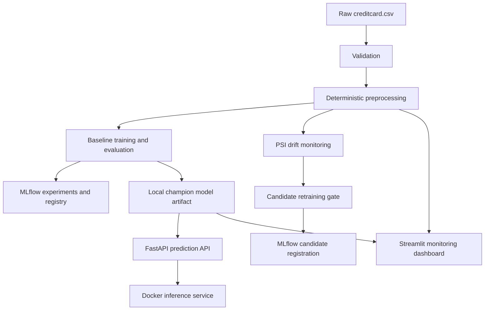

# Financial Anomaly Detection — Lightweight MLOps Pipeline

## Project overview

An end-to-end, student-level MLOps portfolio project for detecting anomalous credit-card transactions. It covers reproducible data preparation, baseline modeling, MLflow experiment tracking, a FastAPI inference service, Docker packaging, CI, drift monitoring, candidate retraining decisions, and a Streamlit dashboard—without unnecessary cloud infrastructure.

## Problem statement

Financial-fraud data is extremely imbalanced, so accuracy alone is misleading. This project identifies likely anomalous transactions and evaluates models with precision, recall, F1, ROC-AUC, and PR-AUC. It also monitors feature-distribution changes so retraining can be considered when the data no longer resembles the training baseline.

## Architecture



## Dataset

The project uses the ULB/Kaggle credit-card fraud dataset placed locally at `data/raw/creditcard.csv`. It contains 284,807 transactions, 31 columns, and a binary `Class` target. The raw CSV, processed CSVs, model artifacts, and MLflow outputs are Git-ignored.

## Data pipeline

`src/data/load.py` reads configured CSV paths. `src/data/validate.py` checks the expected ULB schema, numeric types and ranges, missing values, binary targets, and duplicate rows. `src/data/preprocess.py` validates the raw data, removes exact duplicates only in the derived output, creates `Amount_Log` and `Time_Of_Day`, separates features from `Class`, and saves `data/processed/creditcard_processed.csv`.

Raw data is never modified. Scaling remains inside the training pipeline, where it can be fit only on training data and avoid leakage.

## Model approach

The pipeline creates stratified 60/20/20 train/validation/test splits and trains two class-weighted baselines:

- Logistic Regression with `class_weight="balanced"` and a `StandardScaler` pipeline.
- Random Forest with `class_weight="balanced_subsample"`.

Validation PR-AUC selects the champion because it is more informative than accuracy for rare-positive fraud data. The selected estimator is refit on train plus validation data and evaluated once on the held-out test set.

## MLflow

The `financial-anomaly-detection` experiment records model type, parameters, data fingerprint and shape, validation/test metrics, confusion matrices, and model artifacts. The selected model is registered locally as `financial-anomaly-detection-best-model`.

```bash
python src/models/train.py
mlflow ui --backend-store-uri sqlite:///mlflow.db --port 5000
```

Open `http://127.0.0.1:5000` to compare runs and inspect the registry. Set `MLFLOW_TRACKING_URI` to use another tracking server.

## API

`api/app.py` exposes:

- `GET /health` — verifies that the champion artifact can be loaded.
- `POST /predict` — accepts `Time`, `V1`–`V28`, and `Amount`; Pydantic rejects missing, invalid, or extra fields.

The API calls the same `transform_features()` function used by the preprocessing pipeline, so `Amount_Log` and `Time_Of_Day` cannot drift between training and inference.

```bash
uvicorn api.app:app --reload
```

Interactive documentation: `http://127.0.0.1:8000/docs`.

## Docker

The `python:3.12-slim` Docker image contains the API, source package, and local serving artifact. It deliberately excludes datasets, tests, notebooks, MLflow stores, and development files.

```bash
docker build -t financial-anomaly-api:latest .
docker run --rm -p 8000:8000 --name financial-anomaly-api financial-anomaly-api:latest
curl http://127.0.0.1:8000/health
```

Use a complete JSON request with `Time`, `V1`–`V28`, and `Amount` for `/predict`.

## CI/CD

`.github/workflows/ci.yml` runs on every push and pull request. It installs dependencies, runs Ruff lint/format checks, executes the full Pytest suite plus data-pipeline tests, and builds the Docker image after tests pass. It never deploys to cloud infrastructure.

CI creates a temporary placeholder artifact only for the image-build context because the actual model is intentionally excluded from Git.

## Monitoring

`monitoring/drift.py` compares numerical reference and production samples with Population Stability Index (PSI). Reference quantile bins are fixed, and each feature gets a configurable drift score and `OK`/`DRIFT` status. The default threshold is `0.20`.

```bash
python monitoring/drift.py
```

The command compares the first 80% and final 20% of the local processed dataset to demonstrate the report. In a deployed setting, replace the latter with an incoming production sample.

## Retraining

`src/models/retrain.py` makes the candidate workflow explicit:

1. Detect PSI drift.
2. Skip training when no feature crosses the threshold.
3. Train and select a candidate when drift exists.
4. Compare candidate and current production model on the same test split.
5. Require configured minimum PR-AUC, recall, and PR-AUC improvement.
6. Register an accepted candidate in MLflow as `financial-anomaly-detection-candidates`.

It never overwrites `models/best_model.joblib` or deploys a model. Promotion remains a deliberate manual decision.

```bash
python src/models/retrain.py
```

## Dashboard

`dashboard/app.py` presents model version, transaction/anomaly totals, anomaly percentage, stored test metrics, PSI feature drift, and a FastAPI-backed prediction form.

```bash
streamlit run dashboard/app.py
```

Set `API_URL` to point the dashboard at another FastAPI host if required.

## Installation

```bash
python -m venv .venv
.venv\Scripts\activate
python -m pip install -r requirements.txt
```

Place `creditcard.csv` in `data/raw/`. Do not commit it.

## Usage

```bash
python src/data/preprocess.py
python src/models/train.py
python monitoring/drift.py
python src/models/retrain.py
uvicorn api.app:app --reload
```

## Testing

```bash
ruff check .
ruff format --check .
pytest -q
```

Tests cover validation, preprocessing output, baseline model behavior, metrics, FastAPI health/prediction/input validation, PSI drift detection, and retraining decision gates.

## Results

In the recorded baseline run, Random Forest was selected by validation PR-AUC. Its held-out test metrics were:

| Metric | Value |
| --- | ---: |
| Precision | 0.8974 |
| Recall | 0.7368 |
| F1 | 0.8092 |
| ROC-AUC | 0.9636 |
| PR-AUC | 0.7961 |

Confusion matrix: `[[56643, 8], [25, 70]]`.

These values come from the executed local training run; they can change if the data, split seed, dependency versions, or configuration changes.

## Limitations

- The public dataset is anonymized and may not represent current production fraud patterns.
- PSI covers numeric covariate shift, not concept drift or prediction-quality decay without labels.
- The fixed 0.5 classification threshold is not tuned to a business cost function.
- Monitoring reads local files; it is not a live event-stream system.
- Docker build currently installs the project-wide dependency set rather than a separately minimized serving-only dependency file.

## Future improvements

- Tune thresholds using fraud-review cost and available labels.
- Add calibration, threshold selection, and model explainability.
- Record serving predictions and delayed labels for real performance monitoring.
- Add scheduled retraining review and model approval workflows.
- Split runtime and development dependency files to reduce inference image size further.

## Project structure

```text
├── api/                    # FastAPI inference service
├── dashboard/              # Streamlit monitoring dashboard
├── data/raw/               # Ignored source dataset
├── data/processed/         # Ignored derived dataset
├── monitoring/             # PSI drift detection
├── models/                 # Ignored local model artifacts
├── src/data/               # Loading, validation, preprocessing
├── src/models/             # Training, evaluation, retraining
├── tests/                  # Unit and API tests
├── .github/workflows/ci.yml
├── Dockerfile
└── requirements.txt
```
